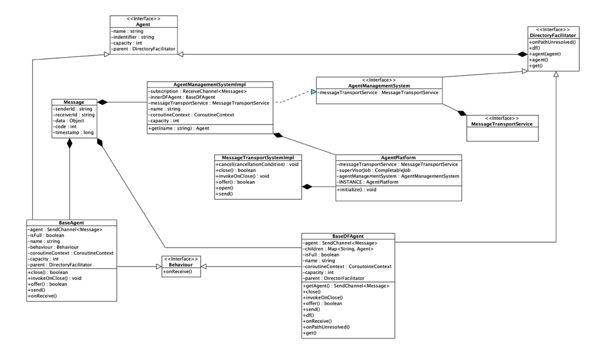

# agency.kt 

A lightweight, fast and convenient agent management system created with Kotlin.

## Introduction

Agent modeling approach is a fairly popular solution of problems of enterprise`s automation.
In view of the obsolescence or monetization of existing agent modeling systems, the **agency.kt** system was created. 
**аgency.kt** is a convenient API for launching and managing an agent platform using modern approaches and convenient extensions.

##  Overview

Common architecture based on 
[kotlin coroutines](https://kotlinlang.org/docs/reference/coroutines-overview.html)
components and  
[FIPA-standard](http://www.fipa.org/specs/fipa00001/SC00001L.html)
of Abstract Architecture Specification. 

It is an abstract layer over the AMS and user researched domain written in [Kotlin 
programming language](https://kotlinlang.org/).

The example of abstract agent platform architecture described below.


Architecture of **agency.kt** is clear and pure, that's why connectivity between agent platform are explicit.
Because of its abstraction users can provide their own behaviors, communication protocols, 
messaging services and so on to describe their domain more accurately and deeply.
All components are atomic, so you can provide your domain dependencies
inside of the agent and their behaviors.
By using custom domain system language the initialization and running the agent takes a couple of code lines.
In addition, system provides structured concurrency because all core services based on `kotlin-coroutines-package` 
components, that are 

> very flexible and delegate most of the functionality to libraries, much in line with Kotlin's philosophy.


### Core components

1) [Agent](http://www.fipa.org/specs/fipa00001/SC00001L.html#_Toc26668620)

    An agent is a computational process that implements the autonomous, communicating functionality of an application. 
Agents communicate using an Agent Communication Language. 
An Agent is the fundamental actor on an AP which combines one or more service capabilities, as published in a service description, into a unified and integrated execution model. 
An agent must have at least one owner, for example, based on organisational affiliation or human user ownership, and an agent must support at least one notion of identity. 
This notion of identity is the Agent Identifier (AID) that labels an agent so that it may be distinguished unambiguously within the Agent Universe. 
An agent may be registered at a number of transport addresses at which it can be contacted.

2) [Directory facilitator(DF)](http://www.fipa.org/specs/fipa00001/SC00001L.html#_Toc26668636)

    A Directory Facilitator is an optional component of the AP, but if it is present, it must be implemented as a DF service.
The DF provides yellow pages services to other agents. 
Agents may register their services with the DF or query the DF to find out what services are offered by other agents. 
Multiple DFs may exist within an AP and may be federated. 

3) Agent management platform

    An Agent Platform (AP) provides the physical infrastructure in which agents can be deployed. 
The AP consists of the machine(s), operating system, agent support software, FIPA agent management components (DF, AMS and MTS) and agents.
The internal design of an AP is an issue for agent system developers and is not a subject of standardisation within FIPA. 
AP’s and the agents which are native to those APs, either by creation directly within or migration to the AP, may use any proprietary method of inter-communication.

4) [Message Transport Service (MTS)](http://www.fipa.org/specs/fipa00001/SC00001L.html#_Toc26668678)

    An Message Transport Service (MTS) is the default communication method between agents on different APs.
    
5) [Message](http://www.fipa.org/specs/fipa00001/SC00001L.html#_Toc26668607)
    
    An immutable unit of data shared between agents in AMS environment.

Relation between described components presented below as UML2.0 class diagram.

 class diagram of agency.kt

## agency.kt in action

1) agency.kt initialization

    Register agent platform by invoking `AgentPlatform`'s object method `initialize`:
    
    ```
    AgentPlatform.initialize(name = "Your awesome AP-name") {
        // ...
    }
    ```
    
2) Then provide your components to agent platform. 
   
   They could be directory facilitators, agents, nested directory facilitators  and so on.
    
   Example of creating directory facilitators `df`:

   ```
     df("platform-df") { 
         df("nested-df") {
                // ...
         }
     }
   ```
    
   ---
   
   Examples of creating agent `agent` described below:
    
   ```
    agent(YourAwesomeAgent())
    
    agent(name = "your-awesome-agent") { message, directoryFacilitator ->  
        //...
    }
    
    agent(name = "your-awesome-agent", behaviour = YourAwesomeBehavior())
    
    agent(name = "your-awesome-agent", behaviour = behaviour { message, directoryFacilitator ->  })
   ```
3) Registration
    After initialization your components within `agency.kt` they would be registered and received
    registration message, that they computation process allowed know.
        
## Contribution

If you want to contribute `agency.kt` please contact me 
- Telegram `@dimitreuzs`
- Mail `dimitreuzsokolov@gmail.com`
